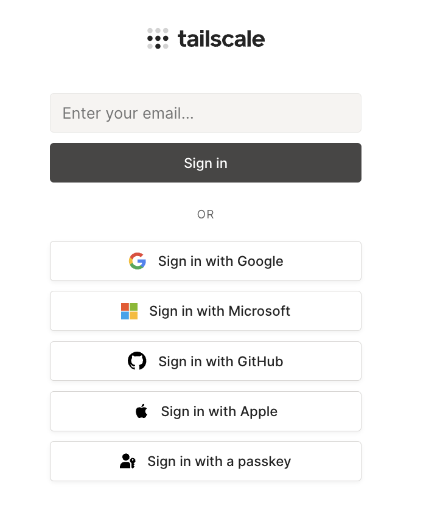
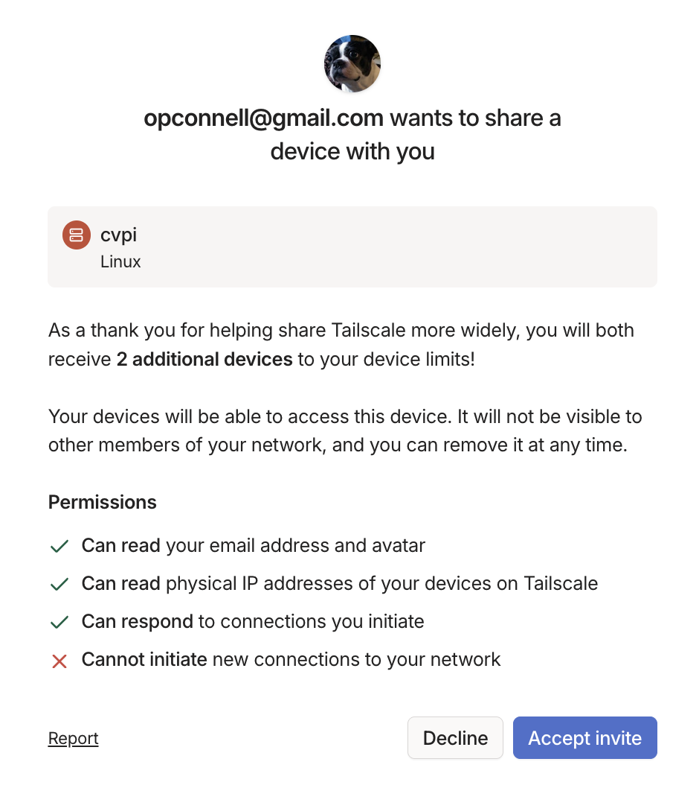

# Remotely Access the Raspberry Pi via Tailscale

We are using [Tailscale](https://tailscale.com) to remotely access and manage the I-STEM Raspberry Pi (`cvpi`) from anywhere. This enables SSH access over a secure private network without needing port forwarding or public IPs.

This guide walks you through how to get connected to the Pi using Tailscale.


## Step 1: Create a Tailscale Account

Go to [login.tailscale.com](https://login.tailscale.com) and create an account.




## Step 2: Follow the Prompts to Install Tailscale and Add Your First Device

Download and install Tailscale from [tailscale.com/download](https://tailscale.com/download) on the device you'll be using to access the Pi.


Your device should appear on the screen like this once connected.


## Step 3: Skip the Rest of the Introduction


Tailscale will prompt you to add a second device. Scroll to the bottom of the page and click “Skip this introduction →”.


## Step 4: Accept Invite for `cvpi`

[https://login.tailscale.com/admin/invite/EVwhLLnNzaT5xVJgjgTy11](https://login.tailscale.com/admin/invite/EVwhLLnNzaT5xVJgjgTy11)



Navigate to the invite link and click **“Accept invite”**.

Once accepted, you should see both your machine and `cvpi` listed in your Tailnet.


## Step 5: Test Your Connection

Test your connection with the following commands.

```bash
$ tailscale status
100.80.156.21   macbook-pro-5        opconnell@   macOS   -
100.103.168.105 cvpi                 opconnell@   linux   idle, tx 1044384 rx 2709056
```

```bash
$ ping cvpi.tail9442c1.ts.net
PING cvpi.tail9442c1.ts.net (100.103.168.105): 56 data bytes
64 bytes from 100.103.168.105: icmp_seq=0 ttl=64 time=109.060 ms
64 bytes from 100.103.168.105: icmp_seq=1 ttl=64 time=133.103 ms
64 bytes from 100.103.168.105: icmp_seq=2 ttl=64 time=13.539 ms

--- cvpi.tail9442c1.ts.net ping statistics ---
9 packets transmitted, 9 packets received, 0.0% packet loss
round-trip min/avg/max/stddev = 13.127/171.450/1015.312/303.293 ms
```

If `tailscale status` does not show `cvpi` or `cvpi` does not resolve, ensure that Tailscale is running and `cvpi` was correctly added to your Tailnet.


## Step 6: SSH into `cvpi`

You can now SSH into the Raspberry Pi using the following command. The password is `vision`.

```bash
$ ssh stem@cvpi.tail9442c1.ts.net
stem@100.103.168.105's password: vision
```


## Summary

- You now have secure SSH access to the I-STEM Raspberry Pi via Tailscale.
- Always use the full hostname `cvpi.tail9442c1.ts.net` when connecting.
- Make sure Tailscale is running on your device before attempting to SSH.
- Use `ssh stem@cvpi.tail9442c1.ts.net` to access the Pi while it’s online.
- You can use tools like VS Code Remote SSH or SCP to develop and transfer files.

Need help? Reach out to Owen.

### Special Thanks

Huge thanks to [**Aahil Lakhani**](https://github.com/Aahil52) for helping me understand Tailscale and guiding me through the setup process.
