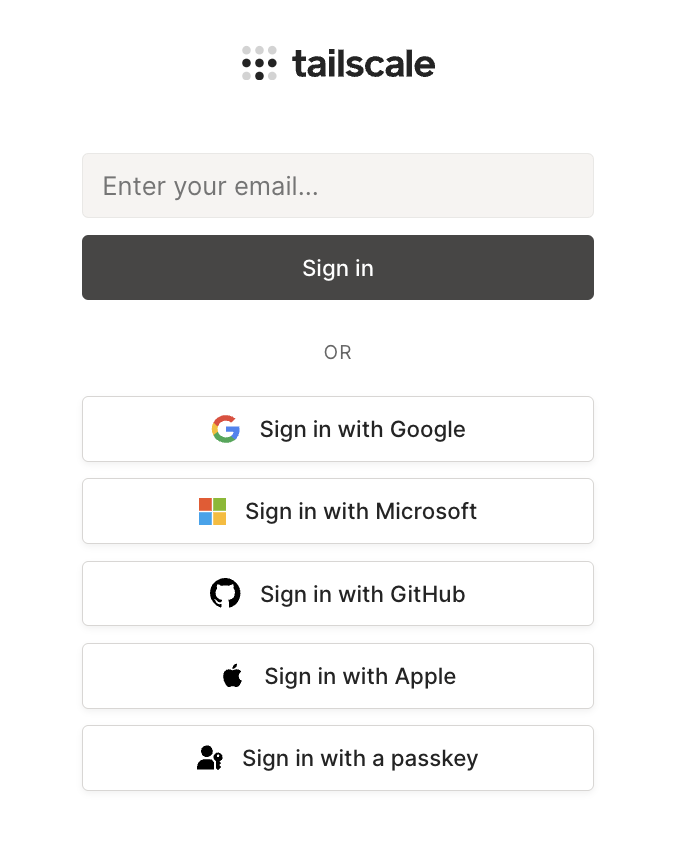
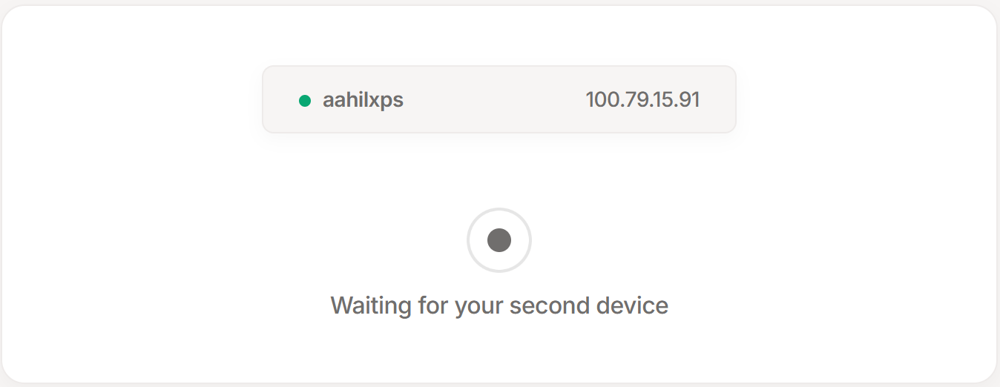
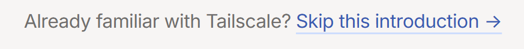
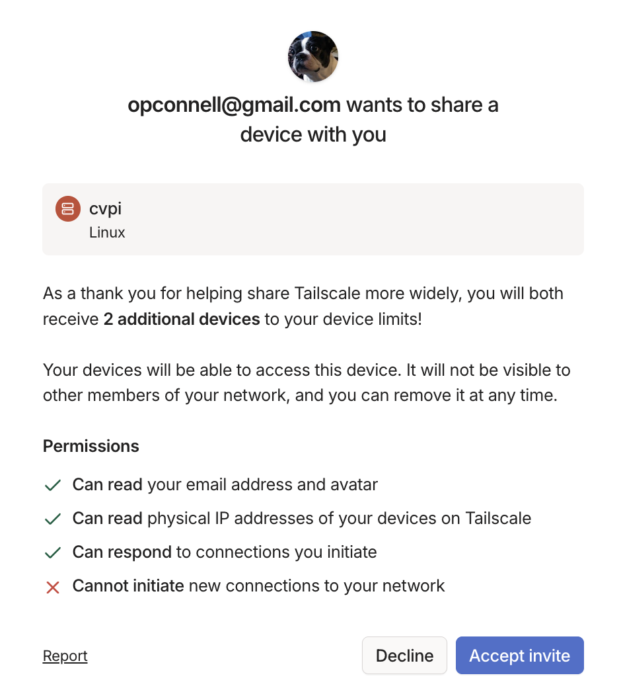

# Remotely Access the Raspberry Pi via Tailscale

We are using [Tailscale](https://tailscale.com) to remotely access and manage the I-STEM Raspberry Pi (`cvpi`) from anywhere. This enables SSH access over a secure private network without needing port forwarding or public IPs.

This guide walks you through how to get connected to the Pi using Tailscale.

## Step 1: Create a Tailscale Account

Go to [login.tailscale.com](https://login.tailscale.com) and create an account.




## Step 2: Follow the Prompts to Install Tailscale and Add Your First Device

Download and install Tailscale from [tailscale.com/download](https://tailscale.com/download) on the device you'll be using to access the Pi.




Your device should appear on the screen like this once connected.

## Step 3: Skip the Rest of the Introduction




Tailscale will prompt you to add a second device. Scroll to the bottom of the page and click “Skip this introduction →”.

## Step 4: Accept Invite for ('cvpi')

[https://login.tailscale.com/admin/invite/EVwhLLnNzaT5xVJgjgTy11](https://login.tailscale.com/admin/invite/EVwhLLnNzaT5xVJgjgTy11)




Navigate to the invite link and click **“Accept invite”**.

Once accepted, you should see both your machine and `cvpi` listed in your Tailnet.

## Step 5: Test Your Connection

Test your connection with the following commands.

```bash
$ tailscale status
```

Example Response:

```bash
100.80.156.21   macbook-pro-5        opconnell@   macOS   -
100.103.168.105 cvpi                 opconnell@   linux   active; direct 10.2.3.191:41641, tx 497344 rx 2083840
```

```bash
$ ping cvpi.tail9442c1.ts.net
```

Example Response:

```base
PING cvpi.tail9442c1.ts.net (100.103.168.105): 56 data bytes
64 bytes from 100.103.168.105: icmp_seq=0 ttl=64 time=97.125 ms
64 bytes from 100.103.168.105: icmp_seq=1 ttl=64 time=15.275 ms
64 bytes from 100.103.168.105: icmp_seq=2 ttl=64 time=35.927 ms
^C
--- cvpi.tail9442c1.ts.net ping statistics ---
10 packets transmitted, 10 packets received, 0.0% packet loss
round-trip min/avg/max/stddev = 5.964/46.910/150.328/44.518 ms
```

If 'tailscale status' does not show 'cvpi' or 'cvpi' does not resolve, ensure that Tailscale is running and ('cvpi') was correctly added to your Tailnet.

## Step 6: SSH into 'cvpi'

You can now SSH into the Raspberry Pi using the following command. The password is ('water').

```bash
$ ssh stem@cvpi.tail9442c1.ts.net
```

## Summary

- You now have secure SSH access to the I-STEM Raspberry Pi via Tailscale.
- Always use the full hostname `cvpi.tail9442c1.ts.net` when connecting.
- Make sure Tailscale is running on your device before attempting to SSH.
- Use `ssh stem@cvpi.tail9442c1.ts.net` to access the Pi while it’s online.
- You can use tools like VS Code Remote SSH or SCP to develop and transfer files.

### Special Thanks

Huge thanks to [**Aahil Lakhani**](https://github.com/Aahil52) for helping me understand Tailscale and guiding me through the setup process.
